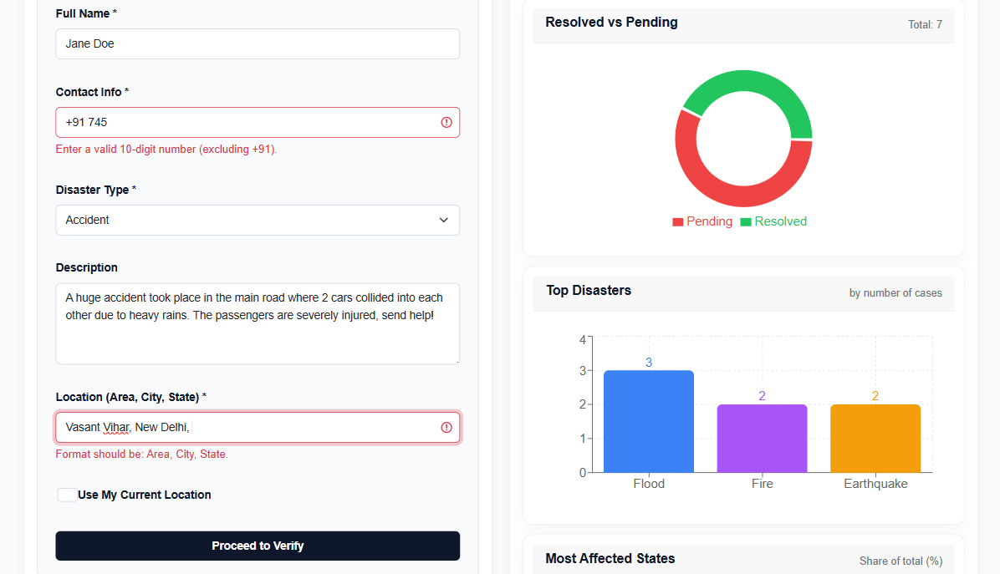
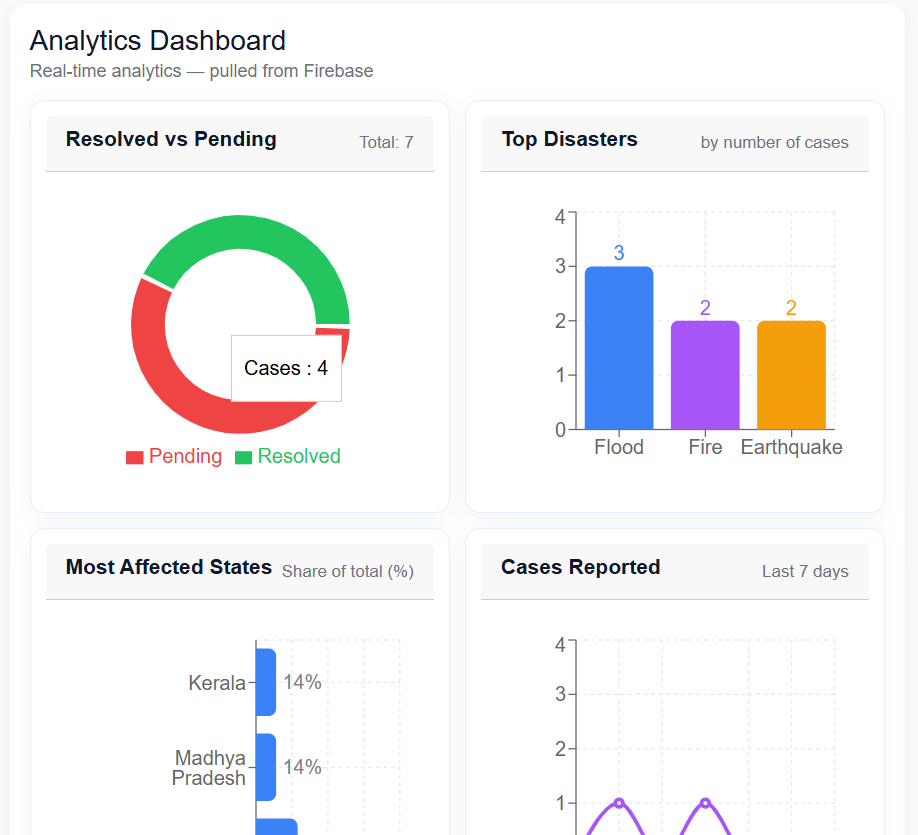

# Disaster Response System

The **Disaster Response System** is a polished, production-ready web application built to enhance disaster reporting, monitoring, and management. Leveraging **React.js** for a dynamic frontend and **Firebase** for backend services—including authentication, real-time database updates, and cloud storage—this platform enables citizens and administrators to communicate and respond efficiently during emergencies.

Key capabilities include **live incident visualization on interactive maps**, **nearest shelter identification with routing guidance**, and **real-time analytics dashboards** that summarize ongoing disaster reports. The system’s clean architecture, modular React components, and user-focused design reflect a careful balance of technical skill and practical problem-solving for real-world disaster response scenarios.


## Features

- **Real-time Disaster Reporting**: Users can submit reports of ongoing incidents, including location, description, and contact details, which are instantly visible to administrators and responders.  
- **Dynamic Live Map Visualization**: Interactive map displaying all active incidents with color-coded markers by status (Pending, In Progress, Resolved) and proximity-based shelter routing.  
- **Nearest Shelter Guidance**: Automatically identifies the closest shelters to a user’s location and provides the optimal route using geospatial routing algorithms.  
- **Administrative Dashboard**: Full-featured admin interface for monitoring incidents, updating statuses, flagging reports, and accessing actionable analytics.  
- **Robust Filtering & Sorting**: Quickly filter reports by status or search by type, location, or reporter for efficient data management.  
- **Progress Analytics**: Visual progress bars and statistics allow administrators to track incident resolution in real-time, improving operational oversight.  
- **Scalable Architecture**: Modular React components and a secure backend allow the system to scale to handle large volumes of users and reports.  
- **Responsive & Intuitive UI**: Clean, modern interface designed for ease of use across desktop and mobile devices.


## Tech Stack

The **Disaster Response System** is built using a modern, reliable, and widely adopted technology stack that ensures scalability, real-time updates, and a responsive user experience:

- **React.js** – Frontend library for building a dynamic, component-based user interface.  
- **Firebase Authentication** – Secure user authentication and role management.  
- **Firebase Realtime Database** – Stores disaster reports and user-submitted data in real time.  
- **React-Leaflet & Leaflet** – Interactive maps for live incident visualization and nearest shelter routing.  
- **Bootstrap** – Responsive styling and layout components.  
- **Recharts** – Analytics dashboards and visual data representation.  
- **Axios** – Handles API requests for route calculations and backend interactions.


## Project Structure
```
disaster-response-system/
├── client/                  # Frontend (React)
│   ├── public/              # Static files
│   │   ├── index.html          # Main HTML entry point
│   │   └── logo.svg            # Project logo
│   ├── src/                 # React source code
│   │   ├── components/         # Reusable components
│   │   │   ├── AdminDashboard.jsx  # Admin dashboard view
│   │   │   ├── LiveMap.jsx        # Live map feature
│   │   │   └── ReportForm.jsx     # Incident report form
│   │   ├── pages/            # Page-level components
│   │   │   ├── AdminPage.jsx     # Admin main page
│   │   │   └── ReportsPage.jsx   # Reports management page
│   │   ├── App.js            # Main app component
│   │   ├── index.js          # App entry point
│   │   └── firebase.js       # Firebase configuration
│   ├── package.json          # Frontend dependencies and scripts
│   └── README.md             # Frontend setup instructions
├── server/                  # Backend (Node.js + Express)
│   ├── routes/              # API routes
│   │   └── adminRoutes.js      # Admin-related API endpoints
│   ├── server.js            # Express server entry point
│   ├── package.json          # Backend dependencies and scripts
│   └── README.md             # Backend setup and API docs
├── .gitignore                # Git ignore rules
└── README.md                 # Project overview and setup guide

```


## Screenshots & Demo

### Home Page
Displays the report form, analytics dashboard, live map, and recent reports.






### Admin Dashboard
Admin panel for managing reports, analytics, and system insights.


### Reports Page
View all disaster reports with filters, sorting, and flagged reports.


### Resource Guidance
Provides recommended resources and guidance for affected areas.


## Future Scope

The Disaster Response System has a solid foundation and can be further enhanced to increase its impact and usability:

- **Advanced User Roles and Permissions**: Implement role-based access for administrators, rescue personnel, and citizens to manage sensitive data securely.  
- **Real-Time Notifications**: Integrate push notifications or email/SMS alerts for new incidents or updates to keep users informed instantly.  
- **Enhanced Mapping Features**: Add real-time disaster heatmaps, multi-incident route planning, and dynamic shelter capacity visualization.  
- **Mobile Optimization**: Improve responsiveness and add PWA capabilities for seamless mobile access during emergencies.  
- **Analytics and Reporting**: Implement advanced dashboards with predictive analytics and trend tracking for disaster management authorities.  
- **Offline Support**: Enable offline reporting and caching for areas with limited connectivity to ensure data reliability during emergencies.  
- **Third-Party Integrations**: Connect with government APIs, weather data, or satellite feeds for more comprehensive disaster intelligence.  


## Author
**Sowmya Dasari**
[GitHub](https://github.com/sowmyadasar1) | [LinkedIn](https://linkedin.com/in/sowmyadasari1) | [Gmail](mailto:sowmyaxdasari@gmail.com)

